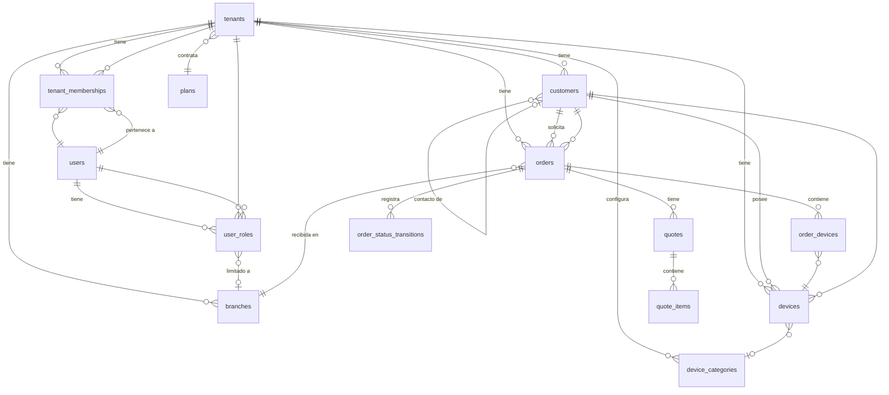

# Modelo de Datos Maestro — Fixi

> [!IMPORTANT]
> Este documento es la referencia canónica de todas las tablas fundacionales. Cada especificación técnica de T01-T20 referencia y extiende este modelo.

---

## Convenciones

- Motor: PostgreSQL 15+.
- Todos los IDs son `UUID v7` (ordenables por tiempo).
- Todas las fechas son `TIMESTAMPTZ` (UTC en almacenamiento, timezone del tenant en presentación).
- Soft-delete usa columna `deleted_at TIMESTAMPTZ NULLABLE`.
- Montos financieros usan `DECIMAL(12,2)`.
- Toda tabla operativa lleva `tenant_id` como discriminador de aislamiento.
- Row-Level Security (RLS) activo por `tenant_id` en toda tabla operativa.
- Enums se modelan como `VARCHAR` con CHECK constraint (no `ENUM` de PostgreSQL para facilitar migraciones).
- JSON flexible usa `JSONB`.
- Índices parciales para queries frecuentes.
- Auditoría se registra en tabla dedicada, no en triggers implícitos.

---

## Tabla: `tenants`

| Columna | Tipo | Constraints | Descripción |
|---------|------|------------|-------------|
| id | UUID | PK | Identificador único |
| name | VARCHAR(255) | NOT NULL | Nombre comercial |
| legal_name | VARCHAR(255) | NULLABLE | Razón social |
| tax_id | VARCHAR(100) | NULLABLE | RFC o identificador fiscal |
| country | VARCHAR(2) | NOT NULL, DEFAULT 'MX' | Código ISO 3166-1 alpha-2 |
| timezone | VARCHAR(50) | NOT NULL, DEFAULT 'America/Mexico_City' | Zona horaria IANA |
| currency | VARCHAR(3) | NOT NULL, DEFAULT 'MXN' | Código ISO 4217 |
| status | VARCHAR(20) | NOT NULL, DEFAULT 'active', CHECK IN (active, suspended, cancelled) | Estado del tenant |
| plan_id | UUID | FK → plans.id, NOT NULL | Plan contratado |
| folio_prefix | VARCHAR(20) | NULLABLE | Prefijo para folios de órdenes |
| folio_next_sequence | BIGINT | NOT NULL, DEFAULT 1 | Siguiente número de folio |
| privacy_policy_url | TEXT | NULLABLE | URL de aviso de privacidad |
| modules_config | JSONB | NOT NULL, DEFAULT '{}' | Módulos habilitados |
| reception_config | JSONB | NOT NULL, DEFAULT '{}' | Campos obligatorios de recepción/checklist |
| warranty_config | JSONB | NOT NULL, DEFAULT '{}' | Políticas de garantía por defecto |
| evidence_retention_days | INTEGER | NOT NULL, DEFAULT 365 | Días de retención de evidencias |
| created_at | TIMESTAMPTZ | NOT NULL | Fecha de creación |
| updated_at | TIMESTAMPTZ | NOT NULL | Última modificación |
| suspended_at | TIMESTAMPTZ | NULLABLE | Fecha de suspensión |
| cancelled_at | TIMESTAMPTZ | NULLABLE | Fecha de cancelación |

**Índices:**
- `idx_tenants_status` ON (status)
- `idx_tenants_plan` ON (plan_id)

---

## Tabla: `plans`

| Columna | Tipo | Constraints | Descripción |
|---------|------|------------|-------------|
| id | UUID | PK | Identificador único |
| name | VARCHAR(100) | NOT NULL | Nombre del plan |
| max_users | INTEGER | NULLABLE | Límite de usuarios (NULL = ilimitado) |
| max_branches | INTEGER | NULLABLE | Límite de sucursales |
| max_orders_per_month | INTEGER | NULLABLE | Límite de órdenes mensual |
| max_storage_mb | INTEGER | NULLABLE | Almacenamiento máximo en MB |
| max_devices | INTEGER | NULLABLE | Límite de dispositivos |
| modules_included | JSONB | NOT NULL, DEFAULT '[]' | Lista de módulos incluidos |
| features | JSONB | NOT NULL, DEFAULT '{}' | Feature flags del plan |
| price_monthly | DECIMAL(10,2) | NOT NULL | Precio mensual |
| price_yearly | DECIMAL(10,2) | NULLABLE | Precio anual |
| currency | VARCHAR(3) | NOT NULL, DEFAULT 'MXN' | Moneda |
| trial_days | INTEGER | NOT NULL, DEFAULT 0 | Días de prueba |
| status | VARCHAR(20) | NOT NULL, DEFAULT 'active', CHECK IN (active, deprecated) | Estado |
| created_at | TIMESTAMPTZ | NOT NULL | |
| updated_at | TIMESTAMPTZ | NOT NULL | |

---

## Tabla: `branches`

| Columna | Tipo | Constraints | Descripción |
|---------|------|------------|-------------|
| id | UUID | PK | Identificador único |
| tenant_id | UUID | FK → tenants.id, NOT NULL | Tenant propietario |
| name | VARCHAR(255) | NOT NULL | Nombre de la sucursal |
| address | TEXT | NULLABLE | Dirección física |
| phone | VARCHAR(50) | NULLABLE | Teléfono |
| timezone | VARCHAR(50) | NULLABLE | Override de timezone (NULL = usa del tenant) |
| status | VARCHAR(20) | NOT NULL, DEFAULT 'active', CHECK IN (active, inactive) | Estado |
| responsible_user_id | UUID | FK → users.id, NULLABLE | Responsable operativo |
| folio_prefix | VARCHAR(20) | NULLABLE | Override de prefijo de folio |
| config | JSONB | NOT NULL, DEFAULT '{}' | Configuración local |
| created_at | TIMESTAMPTZ | NOT NULL | |
| updated_at | TIMESTAMPTZ | NOT NULL | |

**Índices:**
- `idx_branches_tenant` ON (tenant_id)
- `idx_branches_tenant_status` ON (tenant_id, status)

**RLS:** WHERE tenant_id = current_tenant_id()

---

## Tabla: `users`

| Columna | Tipo | Constraints | Descripción |
|---------|------|------------|-------------|
| id | UUID | PK | Identificador único |
| email | VARCHAR(255) | NOT NULL, UNIQUE | Correo electrónico |
| name | VARCHAR(255) | NOT NULL | Nombre completo |
| phone | VARCHAR(50) | NULLABLE | Teléfono |
| status | VARCHAR(20) | NOT NULL, DEFAULT 'invited', CHECK IN (active, invited, suspended, deleted) | Estado global |
| language | VARCHAR(5) | NOT NULL, DEFAULT 'es' | Idioma |
| timezone | VARCHAR(50) | NULLABLE | Preferencia de timezone |
| avatar_url | TEXT | NULLABLE | URL de avatar |
| auth_provider | VARCHAR(50) | NOT NULL, DEFAULT 'email' | Proveedor de autenticación |
| password_hash | TEXT | NULLABLE | Hash de contraseña (NULL si usa SSO) |
| last_login_at | TIMESTAMPTZ | NULLABLE | Último acceso |
| created_at | TIMESTAMPTZ | NOT NULL | |
| updated_at | TIMESTAMPTZ | NOT NULL | |
| deleted_at | TIMESTAMPTZ | NULLABLE | Eliminación lógica |

**Índices:**
- `idx_users_email` UNIQUE ON (email) WHERE deleted_at IS NULL
- `idx_users_status` ON (status)

> [!NOTE]
> `users` es la única tabla operativa SIN `tenant_id` — un usuario puede pertenecer a múltiples tenants vía `tenant_memberships`.

---

## Tabla: `tenant_memberships`

| Columna | Tipo | Constraints | Descripción |
|---------|------|------------|-------------|
| id | UUID | PK | |
| tenant_id | UUID | FK → tenants.id, NOT NULL | |
| user_id | UUID | FK → users.id, NOT NULL | |
| status | VARCHAR(20) | NOT NULL, DEFAULT 'active', CHECK IN (active, suspended, removed) | |
| joined_at | TIMESTAMPTZ | NOT NULL | |
| removed_at | TIMESTAMPTZ | NULLABLE | |

**Constraints:**
- UNIQUE (tenant_id, user_id)

**Índices:**
- `idx_memberships_user` ON (user_id)
- `idx_memberships_tenant_status` ON (tenant_id, status)

---

## Tabla: `user_roles`

| Columna | Tipo | Constraints | Descripción |
|---------|------|------------|-------------|
| id | UUID | PK | |
| tenant_id | UUID | FK → tenants.id, NOT NULL | |
| user_id | UUID | FK → users.id, NOT NULL | |
| role | VARCHAR(30) | NOT NULL, CHECK IN (owner, admin, receptionist, technician, cashier, supervisor) | |
| branch_id | UUID | FK → branches.id, NULLABLE | NULL = acceso a todas las sucursales del tenant |
| granted_by | UUID | FK → users.id, NOT NULL | Quién otorgó el rol |
| granted_at | TIMESTAMPTZ | NOT NULL | |
| revoked_at | TIMESTAMPTZ | NULLABLE | |

**Constraints:**
- UNIQUE (tenant_id, user_id, role, branch_id) WHERE revoked_at IS NULL

**Índices:**
- `idx_roles_tenant_user` ON (tenant_id, user_id) WHERE revoked_at IS NULL
- `idx_roles_tenant_branch` ON (tenant_id, branch_id) WHERE revoked_at IS NULL

---

## Tabla: `customers`

| Columna | Tipo | Constraints | Descripción |
|---------|------|------------|-------------|
| id | UUID | PK | |
| tenant_id | UUID | FK → tenants.id, NOT NULL | |
| name | VARCHAR(255) | NOT NULL | Nombre completo o razón social |
| phone | VARCHAR(50) | NULLABLE | Teléfono principal |
| email | VARCHAR(255) | NULLABLE | Correo electrónico |
| type | VARCHAR(20) | NOT NULL, DEFAULT 'individual', CHECK IN (individual, company, company_contact) | |
| parent_customer_id | UUID | FK → customers.id, NULLABLE | Para contactos de empresa |
| tax_name | VARCHAR(255) | NULLABLE | Nombre fiscal |
| tax_id | VARCHAR(100) | NULLABLE | RFC |
| contact_preference | VARCHAR(20) | NOT NULL, DEFAULT 'whatsapp', CHECK IN (whatsapp, sms, email, phone, none) | |
| data_consent_status | VARCHAR(20) | NOT NULL, DEFAULT 'pending', CHECK IN (pending, accepted, rejected, revoked) | |
| data_consent_date | TIMESTAMPTZ | NULLABLE | Fecha de último consentimiento |
| data_consent_version | VARCHAR(20) | NULLABLE | Versión del aviso aceptado |
| status | VARCHAR(20) | NOT NULL, DEFAULT 'active', CHECK IN (active, blocked, deleted) | |
| notes | TEXT | NULLABLE | Notas internas (NUNCA visibles al cliente) |
| created_at | TIMESTAMPTZ | NOT NULL | |
| updated_at | TIMESTAMPTZ | NOT NULL | |
| deleted_at | TIMESTAMPTZ | NULLABLE | |

**Índices:**
- `idx_customers_tenant_phone` ON (tenant_id, phone)
- `idx_customers_tenant_email` ON (tenant_id, email)
- `idx_customers_tenant_name` ON (tenant_id, name)
- `idx_customers_parent` ON (parent_customer_id) WHERE parent_customer_id IS NOT NULL

**RLS:** WHERE tenant_id = current_tenant_id()

---

## Tabla: `device_categories`

| Columna | Tipo | Constraints | Descripción |
|---------|------|------------|-------------|
| id | UUID | PK | |
| tenant_id | UUID | FK → tenants.id, NOT NULL | |
| name | VARCHAR(100) | NOT NULL | celular, tablet, laptop, consola, etc. |
| identifier_required | BOOLEAN | NOT NULL, DEFAULT true | ¿Exige IMEI/serie? |
| identifier_type | VARCHAR(20) | NOT NULL, DEFAULT 'imei', CHECK IN (imei, serial, both, other, none) | Tipo de identificador |
| is_active | BOOLEAN | NOT NULL, DEFAULT true | |
| created_at | TIMESTAMPTZ | NOT NULL | |

**Constraints:**
- UNIQUE (tenant_id, name)

**RLS:** WHERE tenant_id = current_tenant_id()

---

## Tabla: `devices`

| Columna | Tipo | Constraints | Descripción |
|---------|------|------------|-------------|
| id | UUID | PK | |
| tenant_id | UUID | FK → tenants.id, NOT NULL | |
| customer_id | UUID | FK → customers.id, NOT NULL | Propietario actual |
| category_id | UUID | FK → device_categories.id, NULLABLE | Tipo de dispositivo |
| brand | VARCHAR(100) | NULLABLE | Marca |
| model | VARCHAR(150) | NULLABLE | Modelo |
| color | VARCHAR(50) | NULLABLE | Color |
| serial_number | VARCHAR(255) | NULLABLE | Número de serie |
| imei | VARCHAR(20) | NULLABLE | IMEI (validación Luhn) |
| other_identifier | VARCHAR(255) | NULLABLE | Otro identificador |
| identifier_exception_reason | TEXT | NULLABLE | Motivo si no se capturó identificador |
| custody_status | VARCHAR(20) | NOT NULL, DEFAULT 'not_received', CHECK IN (not_received, in_custody, delivered, lost) | |
| created_at | TIMESTAMPTZ | NOT NULL | |
| updated_at | TIMESTAMPTZ | NOT NULL | |

**Índices:**
- `idx_devices_tenant_imei` ON (tenant_id, imei) WHERE imei IS NOT NULL
- `idx_devices_tenant_serial` ON (tenant_id, serial_number) WHERE serial_number IS NOT NULL
- `idx_devices_customer` ON (tenant_id, customer_id)
- `idx_devices_custody` ON (tenant_id, custody_status)

**RLS:** WHERE tenant_id = current_tenant_id()

---

## Tabla: `orders`

| Columna | Tipo | Constraints | Descripción |
|---------|------|------------|-------------|
| id | UUID | PK | |
| tenant_id | UUID | FK → tenants.id, NOT NULL | |
| branch_id | UUID | FK → branches.id, NOT NULL | Sucursal de recepción |
| customer_id | UUID | FK → customers.id, NOT NULL | |
| folio | VARCHAR(50) | NOT NULL | Folio legible |
| status | VARCHAR(30) | NOT NULL, DEFAULT 'draft', CHECK IN (draft, received, in_diagnosis, diagnosis_completed, quote_sent, awaiting_authorization, authorized, rejected_by_client, in_repair, awaiting_part, repair_completed, quality_check, ready_for_delivery, delivered, cancelled, abandoned, reopened_warranty, closed_admin) | |
| priority | VARCHAR(10) | NOT NULL, DEFAULT 'normal', CHECK IN (low, normal, urgent) | |
| service_type | VARCHAR(100) | NULLABLE | Tipo de servicio |
| received_by | UUID | FK → users.id, NOT NULL | Quién recibió |
| assigned_technician_id | UUID | FK → users.id, NULLABLE | Técnico asignado |
| current_quote_id | UUID | FK → quotes.id, NULLABLE | Presupuesto vigente |
| reception_date | TIMESTAMPTZ | NOT NULL | Fecha de ingreso |
| estimated_completion_date | TIMESTAMPTZ | NULLABLE | Fecha estimada |
| actual_completion_date | TIMESTAMPTZ | NULLABLE | Fecha real de completado |
| delivery_date | TIMESTAMPTZ | NULLABLE | Fecha de entrega |
| delivered_to_name | VARCHAR(255) | NULLABLE | Nombre de quien recoge |
| delivered_to_relationship | VARCHAR(100) | NULLABLE | Relación con cliente |
| delivery_confirmed_at | TIMESTAMPTZ | NULLABLE | Confirmación de entrega |
| delivery_confirmed_by | VARCHAR(255) | NULLABLE | Quién confirmó |
| cancellation_reason | TEXT | NULLABLE | |
| cancelled_at | TIMESTAMPTZ | NULLABLE | |
| cancelled_by | UUID | FK → users.id, NULLABLE | |
| abandonment_declared_at | TIMESTAMPTZ | NULLABLE | |
| internal_notes | TEXT | NULLABLE | Notas internas (NUNCA visibles al cliente) |
| public_notes | TEXT | NULLABLE | Notas visibles al cliente |
| total_quoted | DECIMAL(12,2) | NULLABLE | Total presupuestado vigente |
| total_paid | DECIMAL(12,2) | NOT NULL, DEFAULT 0 | Total pagado |
| balance_due | DECIMAL(12,2) | NOT NULL, DEFAULT 0 | Saldo pendiente |
| created_at | TIMESTAMPTZ | NOT NULL | |
| updated_at | TIMESTAMPTZ | NOT NULL | |

**Constraints:**
- UNIQUE (tenant_id, folio)

**Índices:**
- `idx_orders_tenant_status` ON (tenant_id, status)
- `idx_orders_branch` ON (tenant_id, branch_id)
- `idx_orders_customer` ON (tenant_id, customer_id)
- `idx_orders_technician` ON (tenant_id, assigned_technician_id) WHERE assigned_technician_id IS NOT NULL
- `idx_orders_reception_date` ON (tenant_id, reception_date)
- `idx_orders_delivery_date` ON (tenant_id, delivery_date) WHERE delivery_date IS NOT NULL

**RLS:** WHERE tenant_id = current_tenant_id()

---

## Tabla: `order_devices`

| Columna | Tipo | Constraints | Descripción |
|---------|------|------------|-------------|
| id | UUID | PK | |
| order_id | UUID | FK → orders.id, NOT NULL | |
| device_id | UUID | FK → devices.id, NOT NULL | |
| created_at | TIMESTAMPTZ | NOT NULL | |

**Constraints:**
- UNIQUE (order_id, device_id)

---

## Tabla: `order_status_transitions`

| Columna | Tipo | Constraints | Descripción |
|---------|------|------------|-------------|
| id | UUID | PK | |
| tenant_id | UUID | FK → tenants.id, NOT NULL | |
| order_id | UUID | FK → orders.id, NOT NULL | |
| from_status | VARCHAR(30) | NOT NULL | |
| to_status | VARCHAR(30) | NOT NULL | |
| changed_by | UUID | FK → users.id, NOT NULL | |
| reason | TEXT | NULLABLE | |
| metadata | JSONB | NULLABLE | Datos adicionales del cambio |
| created_at | TIMESTAMPTZ | NOT NULL | |

**Índices:**
- `idx_transitions_order` ON (order_id, created_at)
- `idx_transitions_tenant_date` ON (tenant_id, created_at)

---

## Tabla: `quotes`

| Columna | Tipo | Constraints | Descripción |
|---------|------|------------|-------------|
| id | UUID | PK | |
| tenant_id | UUID | FK → tenants.id, NOT NULL | |
| order_id | UUID | FK → orders.id, NOT NULL | |
| version | INTEGER | NOT NULL | Versión incremental |
| diagnosis_summary | TEXT | NULLABLE | Resumen del diagnóstico |
| subtotal | DECIMAL(12,2) | NOT NULL | Subtotal antes de descuento e impuesto |
| discount_total | DECIMAL(12,2) | NOT NULL, DEFAULT 0 | Total de descuentos |
| tax_total | DECIMAL(12,2) | NOT NULL, DEFAULT 0 | Total de impuestos |
| grand_total | DECIMAL(12,2) | NOT NULL | Total final |
| currency | VARCHAR(3) | NOT NULL, DEFAULT 'MXN' | |
| valid_until | DATE | NULLABLE | Vigencia del presupuesto |
| status | VARCHAR(20) | NOT NULL, DEFAULT 'draft', CHECK IN (draft, sent, accepted, rejected, expired, superseded) | |
| snapshot | JSONB | NULLABLE | Snapshot congelado al momento de aceptación |
| authorized_by_name | VARCHAR(255) | NULLABLE | Nombre de quien autorizó |
| authorized_by_customer_id | UUID | FK → customers.id, NULLABLE | Cliente que autorizó |
| authorized_at | TIMESTAMPTZ | NULLABLE | |
| authorization_channel | VARCHAR(20) | NULLABLE, CHECK IN (portal, in_person, phone, whatsapp, other) | |
| authorization_ip | INET | NULLABLE | IP del autorizante (portal) |
| authorization_user_agent | TEXT | NULLABLE | User agent (portal) |
| authorization_evidence_id | UUID | NULLABLE | FK a evidencia de firma/aceptación |
| rejection_reason | TEXT | NULLABLE | Motivo de rechazo |
| created_by | UUID | FK → users.id, NOT NULL | |
| sent_at | TIMESTAMPTZ | NULLABLE | |
| created_at | TIMESTAMPTZ | NOT NULL | |
| updated_at | TIMESTAMPTZ | NOT NULL | |

**Constraints:**
- UNIQUE (order_id, version)

**Índices:**
- `idx_quotes_order` ON (order_id, version)
- `idx_quotes_tenant_status` ON (tenant_id, status)

---

## Tabla: `quote_items`

| Columna | Tipo | Constraints | Descripción |
|---------|------|------------|-------------|
| id | UUID | PK | |
| quote_id | UUID | FK → quotes.id, NOT NULL, ON DELETE CASCADE | |
| type | VARCHAR(20) | NOT NULL, CHECK IN (labor, part, other) | |
| description | VARCHAR(500) | NOT NULL | |
| quantity | DECIMAL(10,3) | NOT NULL | |
| unit_price | DECIMAL(12,2) | NOT NULL | |
| discount | DECIMAL(12,2) | NOT NULL, DEFAULT 0 | |
| tax | DECIMAL(12,2) | NOT NULL, DEFAULT 0 | |
| total | DECIMAL(12,2) | NOT NULL | |
| inventory_item_id | UUID | NULLABLE | Referencia a refacción si aplica |
| sort_order | INTEGER | NOT NULL, DEFAULT 0 | |
| created_at | TIMESTAMPTZ | NOT NULL | |

**Índices:**
- `idx_quote_items_quote` ON (quote_id)

---

## Tabla: `audit_logs`

| Columna | Tipo | Constraints | Descripción |
|---------|------|------------|-------------|
| id | UUID | PK | |
| tenant_id | UUID | NULLABLE | NULL para acciones de plataforma |
| user_id | UUID | NOT NULL | Actor |
| user_name_snapshot | VARCHAR(255) | NOT NULL | Nombre del usuario al momento de la acción |
| user_role_snapshot | VARCHAR(30) | NULLABLE | Rol del usuario al momento |
| action | VARCHAR(100) | NOT NULL | Ej: order.created, payment.registered, etc. |
| entity_type | VARCHAR(50) | NOT NULL | Tipo de entidad afectada |
| entity_id | UUID | NOT NULL | ID de la entidad |
| previous_state | JSONB | NULLABLE | Estado previo (campos relevantes) |
| new_state | JSONB | NULLABLE | Estado nuevo |
| metadata | JSONB | NULLABLE | Contexto adicional |
| ip_address | INET | NULLABLE | |
| user_agent | TEXT | NULLABLE | |
| is_support_action | BOOLEAN | NOT NULL, DEFAULT false | ¿Acción de soporte Fixi? |
| support_ticket_id | VARCHAR(100) | NULLABLE | Referencia a ticket de soporte |
| support_reason | TEXT | NULLABLE | Motivo de la acción de soporte |
| created_at | TIMESTAMPTZ | NOT NULL | Inmutable |

**Índices:**
- `idx_audit_tenant_entity` ON (tenant_id, entity_type, entity_id)
- `idx_audit_tenant_action` ON (tenant_id, action, created_at)
- `idx_audit_user` ON (user_id, created_at)
- `idx_audit_support` ON (is_support_action, created_at) WHERE is_support_action = true

**Particionamiento:** Por rango de `created_at` (mensual).

> [!IMPORTANT]
> `audit_logs` es append-only. No se permite UPDATE ni DELETE. Sin excepciones.

---

## Tabla: `permissions`

| Columna | Tipo | Constraints | Descripción |
|---------|------|------------|-------------|
| id | UUID | PK | |
| role | VARCHAR(30) | NOT NULL | Rol al que aplica |
| resource | VARCHAR(50) | NOT NULL | Recurso (order, payment, inventory, etc.) |
| action | VARCHAR(30) | NOT NULL | Acción (create, read, update, delete, approve, etc.) |
| conditions | JSONB | NULLABLE | Condiciones adicionales (ej: solo si orden en cierto estado) |
| is_active | BOOLEAN | NOT NULL, DEFAULT true | |

**Constraints:**
- UNIQUE (role, resource, action)

> [!NOTE]
> Esta tabla define la matriz de permisos base del sistema. Los tenants NO personalizan permisos individuales; los permisos dependen del rol asignado.

---

## Relaciones Maestras

---

## Funciones de Aislamiento Multi-Tenant

### `current_tenant_id()`
Función SQL que retorna el `tenant_id` del contexto actual (SET via session variable `app.current_tenant_id`). Usada en todas las políticas RLS.

### `effective_timezone(branch_id UUID)`
Retorna `branches.timezone` si no es NULL, de lo contrario `tenants.timezone`. Usada para presentación de fechas.

### `effective_folio_prefix(tenant_id UUID, branch_id UUID)`
Retorna el prefijo de folio aplicable (branch override > tenant default).

### `next_folio(tenant_id UUID, branch_id UUID)`
Genera el siguiente folio atómicamente usando `SELECT ... FOR UPDATE` sobre `tenants.folio_next_sequence` o `branches.folio_prefix`. Retorna folio formateado.

---

## Transiciones de Estado de Orden (Válidas)

| Desde | Hacia | Requiere |
|-------|-------|----------|
| draft | received | checklist completo (si obligatorio), cliente, dispositivo |
| received | in_diagnosis | técnico asignado |
| received | cancelled | motivo, permiso |
| in_diagnosis | diagnosis_completed | hallazgos registrados |
| diagnosis_completed | quote_sent | presupuesto creado y enviado |
| diagnosis_completed | in_repair | sin costo o presupuesto $0 |
| quote_sent | awaiting_authorization | — |
| awaiting_authorization | authorized | aceptación del cliente |
| awaiting_authorization | rejected_by_client | rechazo del cliente |
| authorized | in_repair | — |
| in_repair | awaiting_part | refacción no disponible |
| awaiting_part | in_repair | refacción recibida |
| in_repair | repair_completed | trabajo registrado |
| repair_completed | quality_check | — |
| quality_check | ready_for_delivery | QA aprobado |
| quality_check | in_repair | QA rechazado |
| ready_for_delivery | delivered | pago completo o excepción, identidad verificada |
| delivered | reopened_warranty | reclamo válido de garantía |
| reopened_warranty | in_diagnosis | nueva evaluación |
| ANY (excepto delivered, cancelled) | cancelled | motivo, permiso, ajustes financieros |
| ready_for_delivery | abandoned | plazo vencido, notificaciones agotadas |
| rejected_by_client | cancelled | — |
| rejected_by_client | awaiting_authorization | nuevo presupuesto |

> [!WARNING]
> Toda transición no listada aquí está PROHIBIDA. El motor de estados debe rechazar transiciones inválidas con error explícito.
