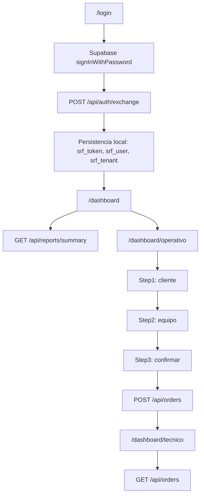

# Mapa completo del flujo de Recepción

Este mapa consolida el recorrido real de `web-admin` desde login hasta la creación de una orden, y marca el punto donde actualmente se está rompiendo el flujo en `Recepción`.

## 1. Objetivo del flujo

1. Usuario entra por `/login`.
2. El frontend autentica con Supabase.
3. El frontend intercambia la sesión con el backend.
4. El dashboard carga datos reales.
5. `Recepción` crea una orden real.
6. La orden debe aparecer en `Técnico`.

## 2. Ruta de ejecución real



## 3. Contratos confirmados

### Autenticación

- `apps/web-admin/src/app/login/page.tsx`
- `apps/web-admin/src/lib/auth.ts`
- `apps/web-admin/src/lib/supabase-browser.ts`

Contrato actual:

- Supabase `signInWithPassword`
- `POST /api/auth/exchange`
- persistencia local en:
  - `srf_token`
  - `srf_user`
  - `srf_tenant`

### Dashboard

- `apps/web-admin/src/app/dashboard/page.tsx`
- consume `GET /api/reports/summary`
- depende de `tenantSlug` y `sucursalId` desde `apps/web-admin/src/lib/tenant.ts`

### Recepción

- `apps/web-admin/src/app/dashboard/operativo/page.tsx`
- `apps/web-admin/src/components/operativo/step-1.tsx`
- `apps/web-admin/src/components/operativo/step-2.tsx`
- `apps/web-admin/src/components/operativo/step-3.tsx`

Contrato esperado:

- Step 1 valida cliente.
- Step 2 valida equipo, falla, fecha y checklist.
- Step 3 confirma.
- `POST /api/orders`
- opcionalmente `POST /api/orders/upload`

### Técnico

- `apps/web-admin/src/app/dashboard/tecnico/page.tsx`
- `apps/web-admin/src/components/tecnico/order-modal.tsx`

Contrato esperado:

- `GET /api/orders`
- `GET /api/orders/:id`
- `PATCH /api/orders/:id/details`
- `PATCH /api/orders/:id/financials`
- `PATCH /api/orders/:id/status`
- `PUT /api/orders/:id/checklist`

### Solicitudes

- `apps/web-admin/src/app/dashboard/solicitudes/page.tsx`
- `apps/web-admin/src/components/solicitudes/request-card.tsx`
- `apps/web-admin/src/components/solicitudes/quote-modal.tsx`

Contrato confirmado:

- `GET /api/requests`
- `POST /api/requests/:id/convert`

## 4. Estado validado

### Funciona

- Login real por UI con `Motriz@gmail.com` / `Coco9921`.
- La sesión se intercambia correctamente con el backend.
- `Dashboard` carga `GET /api/reports/summary` y responde `200`.
- `Técnico` carga `GET /api/orders`.
- `Solicitudes` carga `GET /api/requests`.

### No funciona todavía

- `Recepción` no llega de forma estable al paso de confirmación en el smoke test.

## 5. Punto exacto de falla observado

### Síntoma

En el flujo de `Recepción`, después de completar los campos visibles del paso 2, el formulario no avanza al paso 3 en la prueba automatizada.

### Ubicación probable

- `apps/web-admin/src/components/operativo/step-2.tsx`

### Lo que ya descarté

- No parece ser un problema de backend.
- No parece ser un problema de routing.
- No parece ser un problema de autenticación.
- No parece ser un problema del dashboard general.

### Lo que sigue en la mira

1. sincronización de estado entre `Step2` y `OperativoPage`
2. validación interna de `Step2`
3. disparo real del submit
4. persistencia del estado antes de llegar a `Step3`

## 6. Riesgo principal

El flujo de `Recepción` depende de formularios controlados y de sincronización entre componente hijo y padre. Si el estado local no coincide con el estado que valida el submit, el paso 3 nunca se activa y la orden no se crea.

## 7. Criterio de diagnóstico

La regla para considerar `Recepción` resuelto es:

1. completar Step 1 con datos reales
2. completar Step 2 con datos reales
3. llegar a Step 3
4. disparar `POST /api/orders`
5. verificar que la orden aparezca en `Técnico`

## 8. Resumen corto

- `Login`: ok
- `Dashboard`: ok
- `Técnico`: ok
- `Solicitudes`: ok
- `Recepción`: bloqueado en `Step2` / submit de confirmación

## 9. Código por tramo

### 9.1 Login

Archivo: `apps/web-admin/src/app/login/page.tsx`

```tsx
const { data, error: signInError } = await supabase.auth.signInWithPassword({
  email: email.trim(),
  password,
});

const accessToken = data.session?.access_token;
if (!accessToken) {
  throw new Error('No se obtuvo access token de Supabase.');
}

const { user } = await loginWithSupabase(accessToken);
setActiveSucursalId(user.sucursalId || null);
router.push(redirect);
```

### 9.2 Intercambio de sesión

Archivo: `apps/web-admin/src/lib/auth.ts`

```ts
export async function exchangeSupabaseSession(accessToken: string): Promise<ExchangeResponse> {
  const apiUrl = resolveAdminApiBaseUrl();

  const response = await fetch(`${apiUrl}/api/auth/exchange`, {
    method: 'POST',
    headers: { 'Content-Type': 'application/json' },
    body: JSON.stringify({ accessToken }),
  });
}
```

```ts
export async function loginWithSupabase(accessToken: string): Promise<LoginResponse> {
  const { token, user, tenant } = await exchangeSupabaseSession(accessToken);
  apiClient.setToken(token);

  saveAuthToken(token, true);
  localStorage.setItem('srf_token', token);
  localStorage.setItem('srf_user', JSON.stringify(user));
  localStorage.setItem('srf_tenant', JSON.stringify(tenant));
}
```

### 9.3 Resolución de URL del backend

Archivo: `apps/web-admin/src/lib/api-base-url.ts`

```ts
export function resolveAdminApiBaseUrl(): string {
  for (const candidate of apiUrlCandidates) {
    if (candidate?.trim()) {
      return normalizeBaseUrl(candidate);
    }
  }

  throw new Error('Missing required environment variable: NEXT_PUBLIC_API_URL');
}
```

### 9.4 Cliente HTTP

Archivo: `apps/web-admin/src/lib/api-client.ts`

```ts
const normalizedEndpoint = endpoint.startsWith('/') ? endpoint : `/${endpoint}`;
let url = endpoint.startsWith('http') ? endpoint : `${apiUrl}/api${normalizedEndpoint}`;

if (tenantSlug && !url.includes('/:tenantSlug')) {
  url = url.replace('/api/', `/api/${tenantSlug}/`);
}

if (sucursalId) {
  const separator = url.includes('?') ? '&' : '?';
  url = `${url}${separator}sucursalId=${sucursalId}`;
}
```

### 9.5 Dashboard

Archivo: `apps/web-admin/src/app/dashboard/page.tsx`

```tsx
const data = await apiClient.get<{ data: ReportsSummary }>('/reports/summary', getApiOptions());
setSummary(data.data);
```

### 9.6 Resumen backend

Archivo: `apps/api/src/routes/reports.ts`

```ts
router.get('/summary', requireTenantModule('reports'), requireRole('owner', 'manager'), getReportsSummary);
```

Archivo: `apps/api/src/controllers/reports.ts`

```ts
let ordersQuery = supabase.from('service_orders').select(...).eq('tenant_id', tenantId).limit(500);
let customersQuery = supabase.from('customers').select('id').eq('tenant_id', tenantId).limit(500);
...
return res.json({
  success: true,
  data: {
    ordersCount: orders.length,
    customersCount: customers.length,
    ...
  },
});
```

### 9.7 Recepción

Archivo: `apps/web-admin/src/app/dashboard/operativo/page.tsx`

```tsx
const response = await apiClient.post<{ data: { folio: string; id: string } }>(
  '/orders',
  payload,
  getApiOptions()
);

setSavedFolio(response.data.folio);
setStep(4);
```

### 9.8 Step 1

Archivo: `apps/web-admin/src/components/operativo/step-1.tsx`

```tsx
const validate = () => {
  const newErrors: Record<string, string> = {};
  if (!localData.clienteNombre.trim()) newErrors.clienteNombre = 'El nombre es requerido';
  if (!localData.clienteTelefono.trim()) newErrors.clienteTelefono = 'El teléfono es requerido';
  ...
};

const handleSubmit = (e: React.FormEvent) => {
  e.preventDefault();
  if (validate()) {
    onSubmit(localData);
  }
};
```

### 9.9 Step 2

Archivo: `apps/web-admin/src/components/operativo/step-2.tsx`

```tsx
const validate = () => {
  const newErrors: Record<string, string> = {};
  if (!localData.dispositivo) newErrors.dispositivo = 'Selecciona tipo de dispositivo';
  if (!localData.modelo) newErrors.modelo = 'Completa marca y modelo';
  if (!localData.falla) newErrors.falla = 'Describe la falla';
  if (!localData.fechaPromesa) newErrors.fechaPromesa = 'Selecciona fecha de entrega';
  ...
};

const handleSubmit = (e: React.FormEvent) => {
  e.preventDefault();
  if (validate()) {
    onSubmit(localData);
  }
};
```

### 9.10 Step 3

Archivo: `apps/web-admin/src/components/operativo/step-3.tsx`

```tsx
<Button
  onClick={onSubmit}
  disabled={loading}
  className="btn-primary flex-1"
>
  {loading ? 'Guardando...' : 'Guardar Orden'}
</Button>
```

### 9.11 Técnico

Archivo: `apps/web-admin/src/app/dashboard/tecnico/page.tsx`

```tsx
const data = await apiClient.get<{ data: Order[] }>('/orders', getApiOptions());
setOrders(enrichedOrders);
```

Archivo: `apps/web-admin/src/components/tecnico/order-modal.tsx`

```ts
const orderData = await apiClient.get<{ data: OrderDetail }>(`/orders/${order.id}`, getApiOptions());
...
await apiClient.patch(`/orders/${order.id}/status`, { status }, getApiOptions());
```

### 9.12 Solicitudes

Archivo: `apps/web-admin/src/app/dashboard/solicitudes/page.tsx`

```tsx
const data = await apiClient.get<{ data: ServiceRequest[] }>('/requests', getApiOptions());
...
await apiClient.post(`/requests/${requestId}/convert`, {}, getApiOptions());
```

Archivo: `apps/api/src/routes/requests.ts`

```ts
router.post('/:id/convert', convertRequest);
```

## 10. Lectura directa del bloqueo

El mapa funcional ya no muestra una falla general del sistema. La única zona inestable que queda es `Recepción`, porque `Step2` sigue sin pasar de forma confiable a `Step3` durante el flujo real.

Eso deja una hipótesis concreta:

1. el estado local de `Step2` no está siendo consumido como se espera en submit, o
2. la validación se está ejecutando sobre una copia desfasada del estado, o
3. el click de submit no está disparando el flujo esperado desde la UI real.

## 11. Qué sigo atacando

1. estabilizar `Step2`
2. confirmar que `Step3` se renderiza
3. ejecutar `POST /api/orders`
4. verificar aparición en `Técnico`
